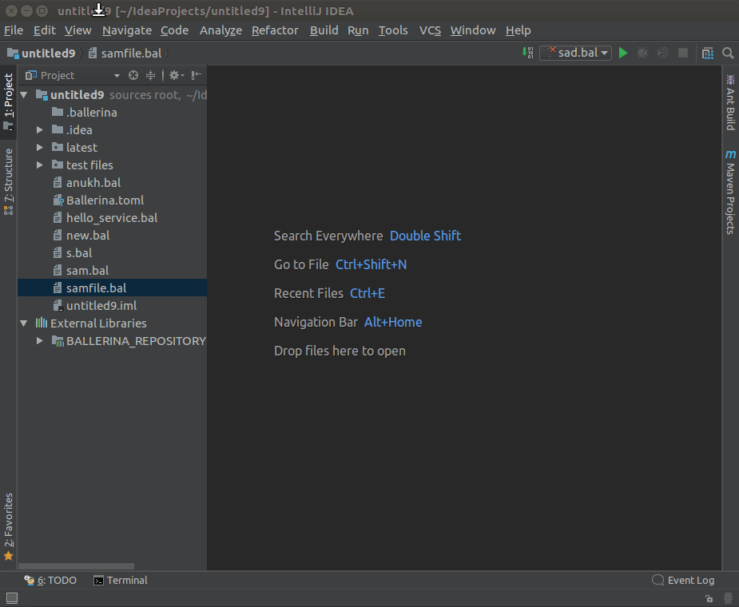
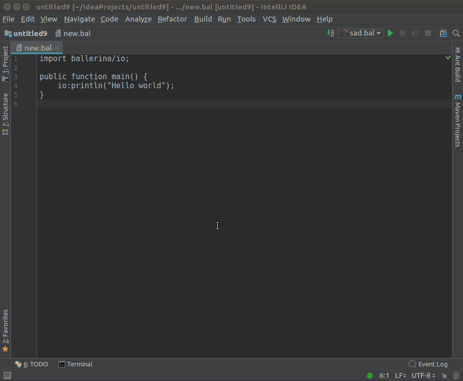

# [Lsp4Intellij](#sp4intellij) - Language Server Client Library for Jetbrains Plugins

[](https://travis-ci.com/NipunaRanasinghe/lsp4intellij)
[](https://jitpack.io/#NipunaRanasinghe/lsp4intellij)

**Lsp4IntelliJ** provides language server support for IntelliJ IDEA and other Jetbrains IDEs.

This language client library is designed to be used with any IntelliJ plugin as its language server client, to get 
language server based features.
It also allows the plugin developers to use language specific language server protocol extensions via [JSON-RPC](https://en.wikipedia.org/wiki/JSON-RPC) 
protocol.

## How To Use

Please follow the below steps to use `Lsp4IntelliJ`  in your custom language plugin.

### 1. Add `lsp4intellij` dependency in project build file
  
Refer [jitpack/lsp4intellij](https://jitpack.io/#NipunaRanasinghe/lsp4intellij) to learn how you can add 
  **Lsp4IntelliJ** as a dependency with different build tools, which are listed below.
  - gradle
  - maven
  - sbt
  - leiningen
  
  **Note** - Will be available soon in maven central as maven publishing process is WIP.

### 2. Add server definition

To add a language server, you can instantiate a concrete subclass of `LanguageServerDefinition` and 
register it using a PreloadingActivity in your plugin implementation.

The following concrete class is currently implemented (more options will be added later):

- **RawCommandServerDefinition(string fileExtension,string[] command):** This definition simply runs the command 
given.You can specify multiple extensions for one server by separating them with a comma. (e.g: "ts,js")

    Examples: 
    
    Ballerina Language Server 
    ```java
     new RawCommandServerDefinition("bal", new String[]{"<path/to/launcher-script.sh>"});
    ```
    
    BSL Language Server
    ```java
     String[] command = new String[]{"java","-jar","path/to/language-server.jar","--diagnosticLanguage"};
     new RawCommandServerDefinition("bsl,os",command);
    ```
    
> Note that all these implementations will use server stdin/stdout to communicate.

To register any of the aforementioned concrete methods, implement a preloading activity as shown below;
    
```java
public class BallerinaPreloadingActivity extends PreloadingActivity {
    IntellijLanguageClient.addServerDefinition(new RawCommandServerDefinition("bal", new String[]{"<path/to/launcher-script.sh>"}));
}
```

With plugin.xml containing;

```
<extensions defaultExtensionNs="com.intellij">
      <preloadingActivity implementation="io.ballerina.plugins.idea.preloading.BallerinaPreloadingActivity" id="io.ballerina.plugins.idea.preloading.BallerinaPreloadingActivity" />
  </extensions>
```

Refer [InteliJ Plugin initialization on startup](https://www.plugin-dev.com/intellij/general/plugin-initial-load/) to see other various options you can use instead of implementing a preloading activity.

### 3. Add configurations to plugin.xml 
   
  - `IntellijLanguageClient` must be added as an application component. 
       ```
        <application-components>
               <component>
                   <implementation-class>com.github.lsp4intellij.IntellijLanguageClient</implementation-class>
               </component>
           </application-components>
       ```
       
  - Add the following extensions to get the relevant features, as listed below.
  
    - Code completion
        ```
        <extensions defaultExtensionNs="com.intellij">
               <completion.contributor implementationClass="com.github.lsp4intellij.contributors.LSPCompletionContributor"
                                       id="LSPCompletionContributor" language="any"/>
           </extensions>
        ```
        
    - Diagnostics and code actions
        ```
         <extensions defaultExtensionNs="com.intellij">
                <inspectionToolProvider implementation="com.github.lsp4intellij.contributors.inspection.LSPInspectionProvider"
                                        id="LSPInspectionProvider"/>
            </extensions>
        ```
        
  - **Note** You won't need any additional configurations for the other features.
      
If you've connected to your language server successfully, you'll see a green icon at the bottom-right side of your 
IDE when opening a file which has a registered file extension, as shown below.


   
You can also click on the icon to see the connected files and the timeouts.


   

## Features 
- Code Completion 
- Diagnostics 
- Code Actions
- Go to Definition

 **WIP** 
 - Code Formatting
 - Go to References / Find Usages
 - Hover Support
 - Signature Help
 
> **Note** - Currently tested with IntelliJ IDEA and
[Ballerina Language Server](https://github.com/ballerina-platform/ballerina-lang/tree/master/language-server). Need 
to be tested with other language servers and other Jetbrains IDEs as well.

## Inspiration

`Lsp4IntelliJ` is heavily inspired by [intellij-lsp](https://github.com/gtache/intellij-lsp) community. 
Credits should go to the original author for his awesome work.